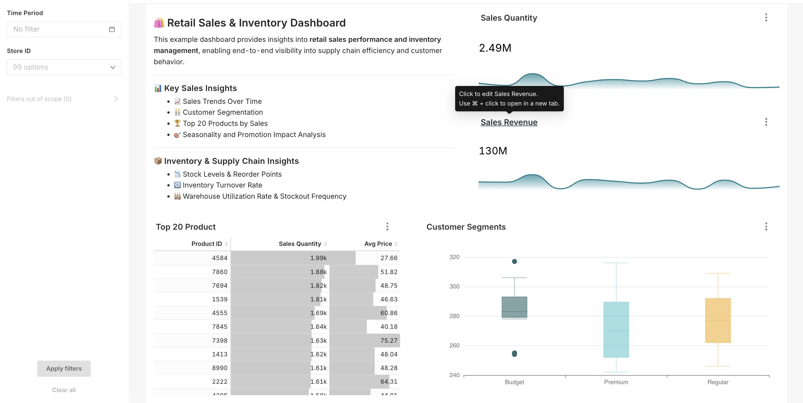
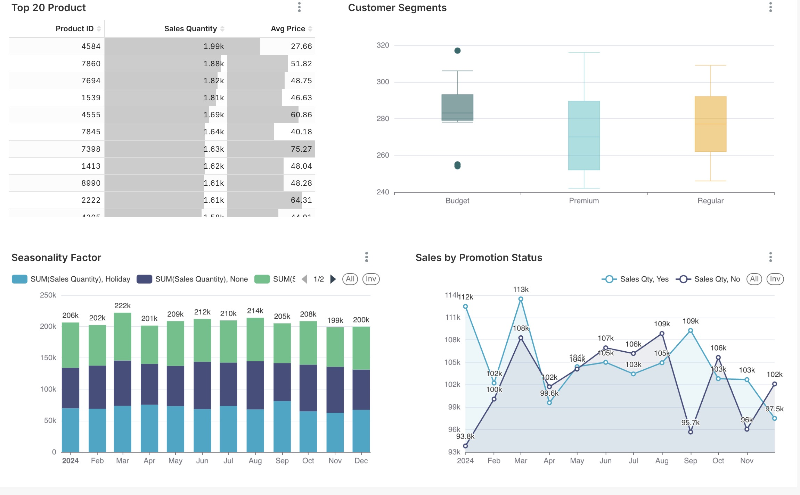
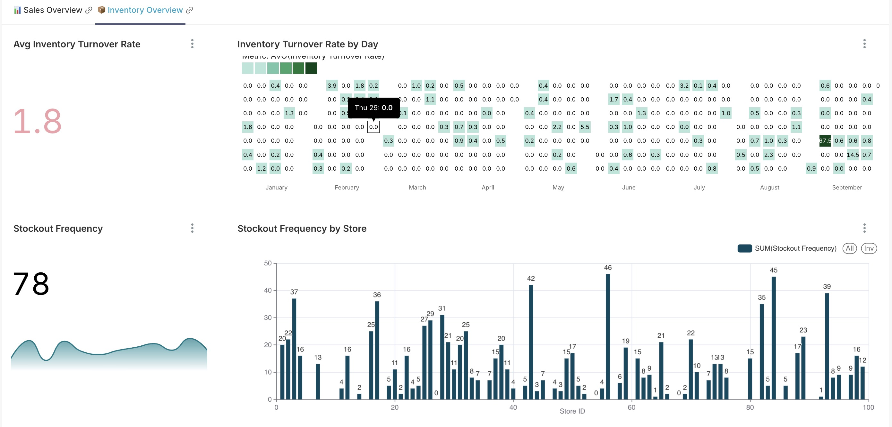
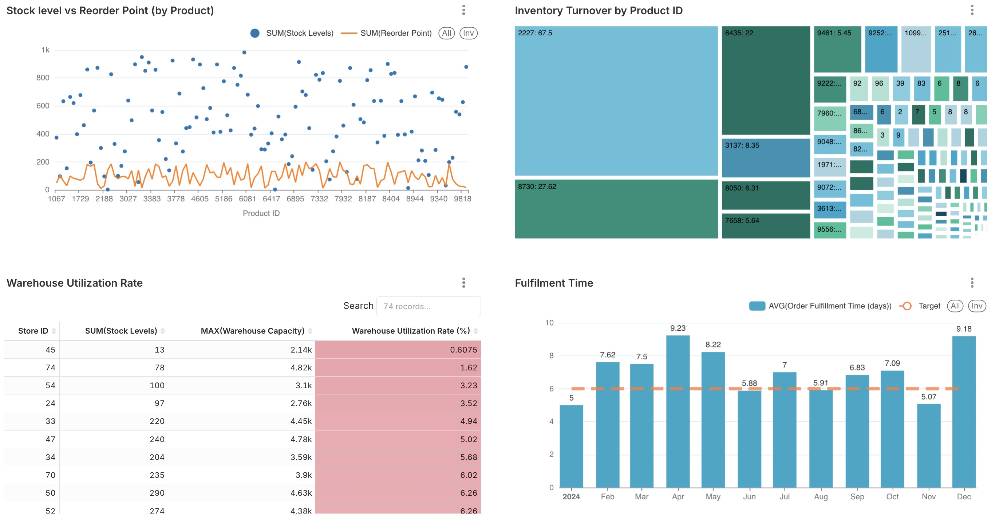

# 🛍️ Retail Sales & Inventory Dashboard

This interactive Superset dashboard provides actionable insights into **retail sales performance** and **inventory operations**, offering end-to-end visibility into supply chain efficiency and customer behavior. It is designed for business analysts, supply chain managers, and retail strategists to explore trends, improve forecasting, and optimize stock levels.

---

## 🖼️ Dashboard Preview

### Sales Overview

### Sales Overview

### Inventory Overview

### Inventory Overview

---

## 📊 Key Insights

### 💰 Sales Performance
- **📈 Sales Trends Over Time** – Visualize revenue and quantity trends by date.
- **🧑‍🤝‍🧑 Customer Segmentation** – Explore customer clusters
- **🏆 Top 20 Products by Sales** – Highlight the highest-performing products.

### 🎯 Marketing & Promotions
- **📆 Seasonality & Promotion Impact** – Understand how time and campaigns affect sales.

### 📦 Inventory & Supply Chain
- **📉 Stock Levels & Reorder Points** – Monitor inventory status across stores.
- **🔁 Inventory Turnover Rate** – Assess efficiency of inventory flow.
- **🏭 Warehouse Utilization & Stockout Frequency** – Detect operational risks.
- **🚚 Fulfillment Time** – Measure delivery performance to stores.

---

## 📚 Dataset Source

The dashboard uses two public datasets sourced from [Kaggle](https://www.kaggle.com/](https://www.kaggle.com/datasets/suvroo/inventory-optimization-for-retail/data)):

- **`demand_forecasting.csv`**  

- **`inventory_monitoring.csv`**  

### 🔗 Data Schema & Join Keys

These datasets are **linked via**:

- `Product ID`
- `Store ID`

This join allows analysis of sales and inventory across multiple stores and products with consistent context.

